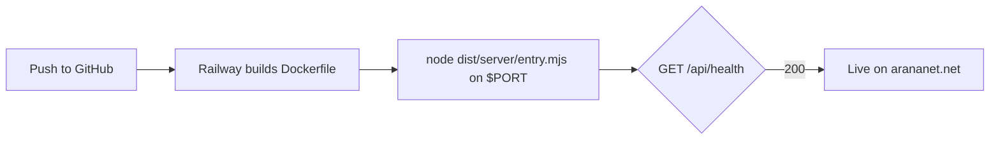

# arananet-site

     

> Personal hub and live lab for Eduardo Arana (arananet.net), built with Astro and deployed on Railway.

The site is a hub (about, projects, contact, Ko-fi) plus a **lab** of demos
that actually run:

- **Terminal**: navigate the site from a shell on the home page. Try `help`.
- **Spec wall** (`/lab/specs`): renders this repository's own OpenSpec specs
  live, so the site documents the spec-driven [benchodev](https://bencho.dev/)
  workflow that builds it.
- **Health** (`/api/health`): the JSON endpoint Railway uses as its healthcheck.

---

## Quick start

Requires Node.js >= 22.12 and npm. The OpenSpec hooks also need Bash, Git and
Ruby >= 2.6.

```bash
git clone https://github.com/arananet/bencho-tests.git
cd bencho-tests
npm ci
bash setup.sh   # installs the OpenSpec git hooks

npm run dev     # http://localhost:4321
npm test        # unit + integration tests (builds and boots the server)
```

## Usage

Edit the copy in [`src/data/profile.ts`](src/data/profile.ts): name, tagline,
about paragraphs, links, projects, and lab experiments. The terminal commands
read from the same file, so they stay in sync.

```bash
npm run build && PORT=8080 npm start
curl http://localhost:8080/api/health
# {"status":"ok","version":"0.1.0","uptime":3}
```

| Path | What it is |
| --- | --- |
| `src/pages/` | Routes: `/`, `/lab/specs`, `/api/health`, 404 |
| `src/lib/` | Pure logic: terminal commands, spec loader, health, security headers |
| `src/middleware.ts` | Adds CSP and security headers to production responses |
| `tests/unit/`, `tests/integration/` | Vitest suites |
| `Dockerfile`, `railway.json` | Railway deployment |

---

## Deploy on Railway



1. In Railway, create a project, then **Deploy from GitHub repo** and pick
   this repository. Railway reads [`railway.json`](railway.json): Dockerfile
   build, `/api/health` healthcheck, restart on failure.
2. No environment variables are required. Railway injects `PORT`; the image
   listens on `0.0.0.0`. Optional: `SPECS_DIR` overrides where the spec wall
   reads specs from.
3. Under **Settings → Networking**, add the custom domain `arananet.net` (and
   `www`), then create the DNS records Railway shows at your DNS provider.

---

## Contributing

This project uses **OpenSpec** for spec-driven development: every feature
or bugfix starts with a spec file under `.openspec/specs/`, and the spec,
implementation, and tests ship together.

```bash
bash scripts/openspec scaffold "my feature"
bash scripts/openspec check
bash scripts/openspec verify <slug>
```

See [`docs/OPENSPEC.md`](docs/OPENSPEC.md) for the workflow and
[`CONTRIBUTING.md`](CONTRIBUTING.md) for the contributor checklist.

---

## Documentation

| Topic | Where |
| --- | --- |
| Spec-driven workflow | [`docs/OPENSPEC.md`](docs/OPENSPEC.md) |
| Small-project adoption and assessment | [`docs/ADOPTION.md`](docs/ADOPTION.md) |
| Branch protection setup | [`docs/BRANCH_PROTECTION.md`](docs/BRANCH_PROTECTION.md) |
| Architecture decisions | [`docs/adr/`](docs/adr/) |
| Security policy | [`SECURITY.md`](SECURITY.md) |
| Support channels | [`SUPPORT.md`](SUPPORT.md) |
| Release history | [`CHANGELOG.md`](CHANGELOG.md) |

---

## License

[MIT](LICENSE)

---

## Developer

Eduardo Arana

## Support this with a ko-fi

[](https://ko-fi.com/H2H51MPWG)
